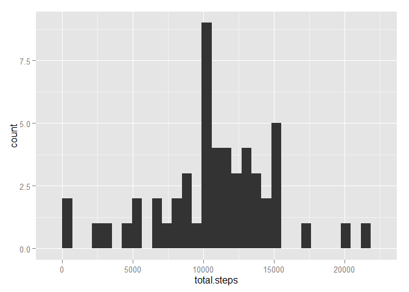
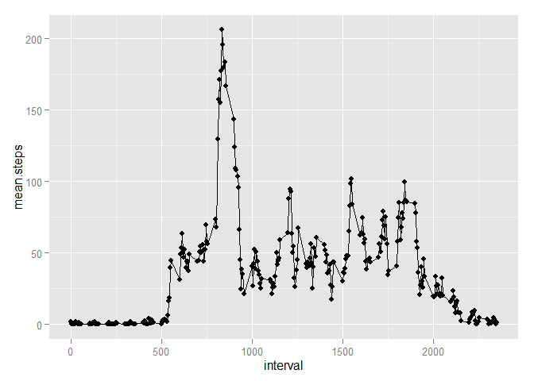
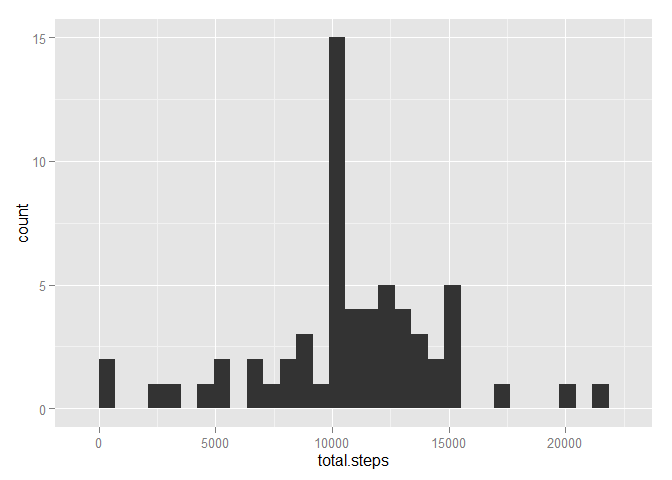
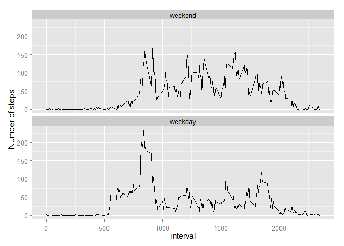

# Reproducible Research: Peer Assessment 1


#### Loading and preprocessing the data
First you must load the data into your working directory, but it does not need to be unzipped

```r
con<-"C:/Users/dgorman/Documents/GitHub/RepData_PeerAssessment1/activity.zip"
dat<-read.csv(unz(con, "activity.csv"),stringsAsFactors=FALSE)
dat$date<-as.Date(dat$date)
```

The code below requires the following packages to execute the analysis

* plyr 
* ggplot2


```r
library(plyr)
library(ggplot2)
```

### What is mean total number of steps taken per day?
**Answer**: 

The mean steps taken per day is   :  **10766.19**

the median steps taken per day is :  **10765**

  1. First calculate the total steps each day

```r
stepcount<-ddply(dat, .(date), summarize, total.steps=sum(steps))
```

  2. Then calcualte the mean and median of total steps across all days, and print it nicely 


```r
with(stepcount, {
  cat("The mean steps taken per day is   : ", mean(total.steps, na.rm=T ), fill=T)
  cat("the median steps taken per day is : ", median(total.steps, na.rm=T))
  })
```

```
## The mean steps taken per day is   :  10766.19
## the median steps taken per day is :  10765
```

**Histogram of the average number of steps taken each day**


```r
qplot(total.steps, data=stepcount, geom="histogram")
```

```
## stat_bin: binwidth defaulted to range/30. Use 'binwidth = x' to adjust this.
```

 

### What is the average daily activity pattern?
**Answer: Some basic observations**

* The period with the highest average number of steps is 835  (206 steps)
* Between 10 PM and 5 AM, the activitiy is very minimal (obviously people tend to sleep during these hours)
* The most active period (on average) seems to be between 8 and 9 AM
* There is quite a bit of variablity in activity throughout the day with the number of steps on aveage ranging between 25 and 100 Steps per 5 minute interval.

  1. Calculate the mean number of steps per time period

```r
stepsbyinterval<-ddply(dat, .(interval), summarize, mean.steps=mean(steps, na.rm=T))
```

  2. Then generate a plot showing the average number of steps per time interval


```r
with(stepsbyinterval, {
  qplot(interval, mean.steps, geom=c("point", "line")) 
})
```

 

  3. determine the interval with the highest average number of steps
    The results below show that the highest average number of steps occurs at the **835** minute interval 

```r
maxint<-which.max(stepsbyinterval$mean.steps)
stepsbyinterval[maxint,]
```

```
##     interval mean.steps
## 104      835   206.1698
```


### Imputing missing values

**Answer:** *Results with Imputed values*

The mean steps taken per day is   :  **10762.05**  *compared to 10766, with NA* 

the median steps taken per day is :  **10571**     *compared to 10765, with NA* 

The results are not that different.  I would have expected them to be close, as we are using measures of center (mean and median) to impute the values.  Then using these to re-estimate the measure of center again, they should have little influence.  *(note that the histogram has higher peaks at the imputed values since the same imputed values are being used muliple times)*

To answer this question I first determine which columns contain missing data
The results in the table below indicate that the only column with "NA"s is the "Steps" column 

```r
dat$steps.na<-is.na(dat$steps)
dat$date.na<-is.na(dat$date)
dat$interval.na<-is.na(dat$interval)
count(dat, vars=c("steps.na", "date.na", "interval.na"))
```

```
##   steps.na date.na interval.na  freq
## 1    FALSE   FALSE       FALSE 15264
## 2     TRUE   FALSE       FALSE  2304
```

**Imputing algorithm** 

For imputing, I average the number of steps for weekends and weekdays for each Interval (assuming a difference in activity pattern)

  1. Create an logical vector for "weekend vs. weekday"

```r
dat$weekend<-weekdays(dat$date) %in% c("Saturday", "Sunday")
```

  2. Calcluate the average number of steps for each interval by weekday/weekend save to a new dataframe

```r
imputes<-ddply(dat, .(interval, weekend), summarize, mean.steps=mean(steps, na.rm=T))
```

  3. Merge the original data and imputed data to get a row of imputed values for each interval weekend/weekday combination

```r
combined<-merge(dat, imputes)
```

  4. Using a "for loop", I create a new variable "steps.complete" that contains the measured steps when not missing and imputed values when missing


```r
for(i in seq_len(nrow(combined))) {
  if(is.na(combined$steps[i])==TRUE) {combined$steps.complete[i]<-combined$mean.steps[i]}
     else {combined$steps.complete[i]<-combined$steps[i]}
}
```

  5. calculate the steps per day (with imputed value)

```r
stepcount2<-ddply(combined, .(date), summarize, total.steps=sum(steps.complete))
```

  6. Then calculate the mean and median steps per day (with imputed values)

```r
with(stepcount2, {
  cat("The mean steps taken per day is   : ", mean(total.steps, na.rm=T ), fill=T)
  cat("the median steps taken per day is : ", median(total.steps, na.rm=T))
  qplot(total.steps, geom="histogram") 
})
```

```
## The mean steps taken per day is   :  10762.05
## the median steps taken per day is :  10571
```

```
## stat_bin: binwidth defaulted to range/30. Use 'binwidth = x' to adjust this.
```

 

### Are there differences in activity patterns between weekdays and weekends?

*The following results utilize the imputed values in place of NA* 

**Answer:** 

There appear to be differences between weekend and weekday patterns 

* The waking pattern on weekends is more gradual (note differences in plots at 5-6 AM)
* The general activity level through the course of the day is higher on weekends than weekdays.
* People tend to wind down their activity level earlier on weekdays as compared to weekends.

  3. In order to facet and get weekend and weekdays in order to match the sample, I create a factor from weekend variable and order it appropriately

```r
combined$day.type<-ifelse(combined$weekend==TRUE, "weekend","weekday")
combined$day.type<-factor(combined$day.type, levels=c("weekend", "weekday"))
```

  4. calcualte the mean number of steps for each interval, weekend/weekday combination

```r
stepsbyinterval2<-ddply(combined, .(interval, day.type), summarize, mean.steps=mean(steps.complete, na.rm=T))
```

  5. Plot time series of steps per interval for both weekend and weekday

```r
panel.plot<-qplot(interval, mean.steps, data=stepsbyinterval2, geom=c("line"), ylab="Number of steps") 
panel.plot+facet_wrap(~day.type, nrow=2)
```

 
